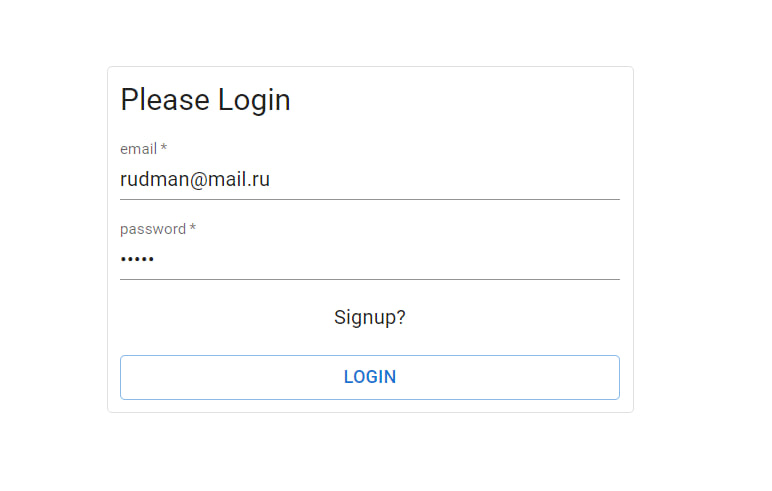
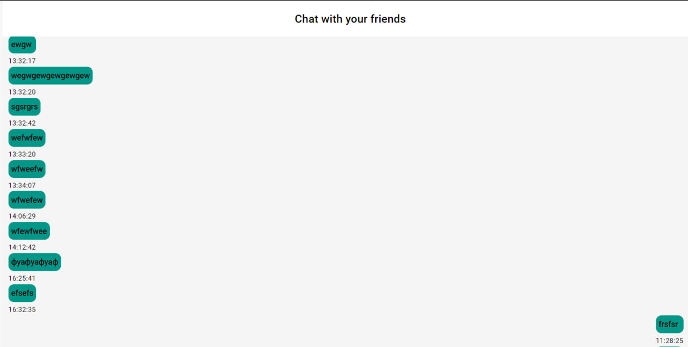
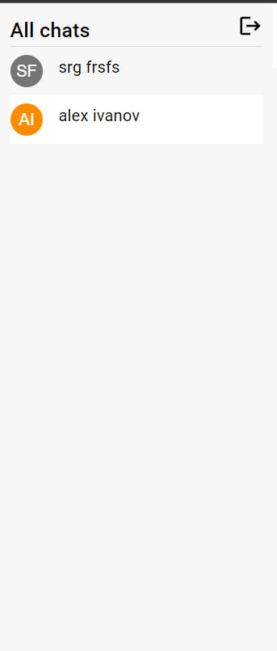

## Description

Fullstack chat

---

## Running the app

start the server:
1) cd server
2) npm i
3) npm start

start the client:
1) cd client
2) npm i
3) npm start

Then go to http://localhost:3000 to interact with client
Also you can go to http://localhost:4000/graphql to interact with graphql 
---
## Running the database migrations
npx prisma migrate dev --name init 

